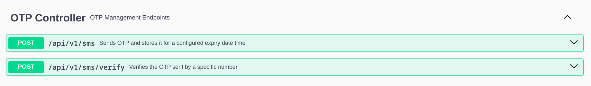
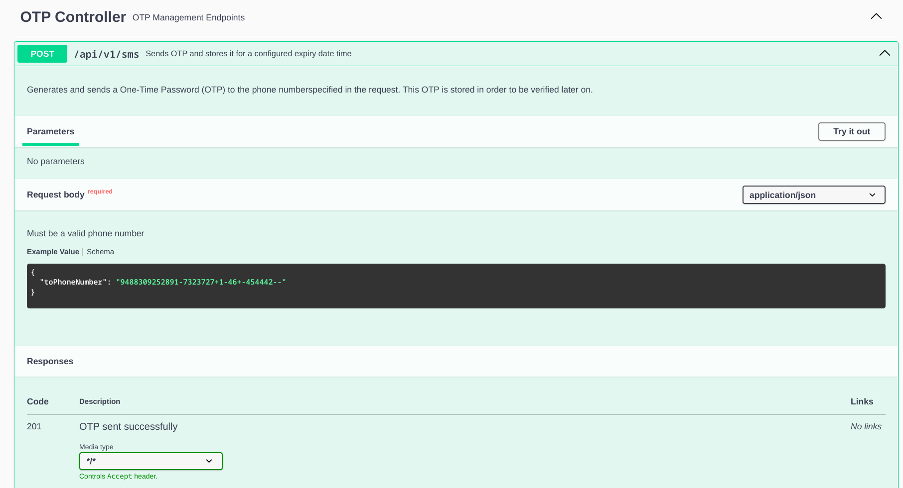
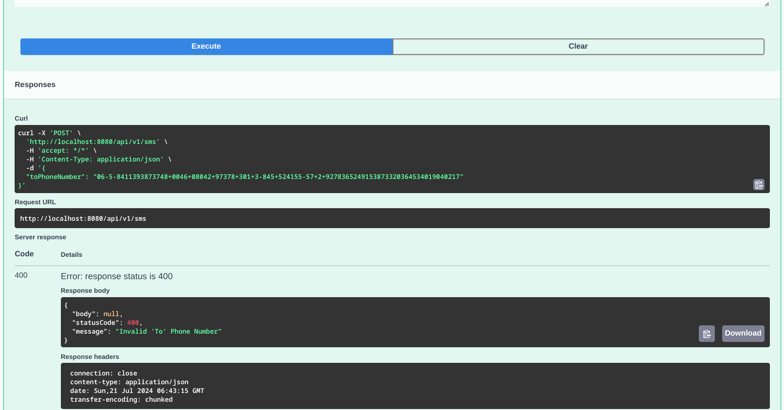

# How To Use
This is an API Documentation to check all endpoints and requests, responses descriptions and examples using this [link](http://localhost:8080/swagger-ui/index.html).

After you run you just go to this endpoint ```http://localhost:8080/swagger-ui/index.html``` on your browser/HTTP Client.

Another option is to go to this one ```http://localhost:8080/v3/api-docs```, but it wont have lots of visuals like the other one

- This is what you will find if you go to the first endpoint

- You can list any of the endpoints and read the request/response schemas and examples


- You can also execute your own test requests and see their responses by clicking on ``Try it out`` that is in the second image beside ``Parameters``

- If we execute it like this let's see the response

